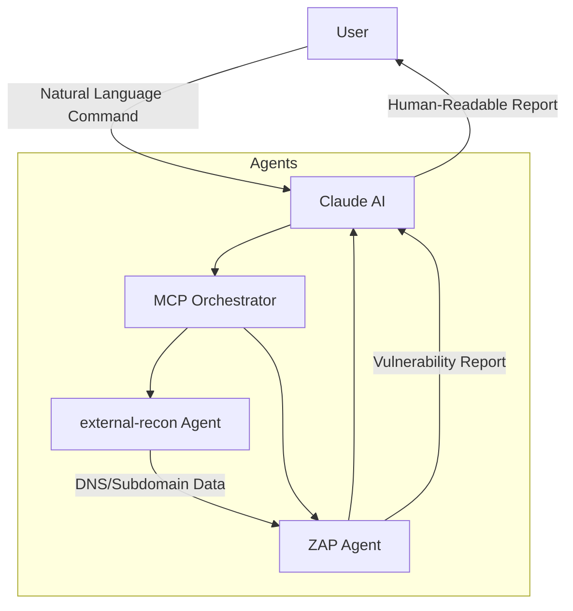

# MCP FOR CYBERSECURITY (ZAP Integration + External Recon)

## Dokumentasi dan Penggunaan

### Ringkasan
Dokumen ini menjelaskan agen MCP eksternal dan integrasinya dengan ZAP (Zed Attack Proxy) untuk pengujian keamanan web otomatis. Sistem ini menggabungkan kemampuan analisis Claude dengan alat keamanan melalui protokol MCP.

### Diagram Arsitektur

### Dokumentasi Penggunaan
#### Fitur Utama
* DNS Reconnaissance (Menggunakan dig dan whois)
* Subdomain Enumeration (dns recon)
* Email security checks
* HTTP Header Analysis

### Example Of Usage
1. Pada percobaan tools ini saya menargetkan target kecamatanciseeng.bogorkab.go.id
2. Prompt yang saya gunakan menggunakan bahasa inggris sebagai berikut: "Perform  reconnaissance test on kecamatanciseeng.bogorkab.go.id"

3. 
