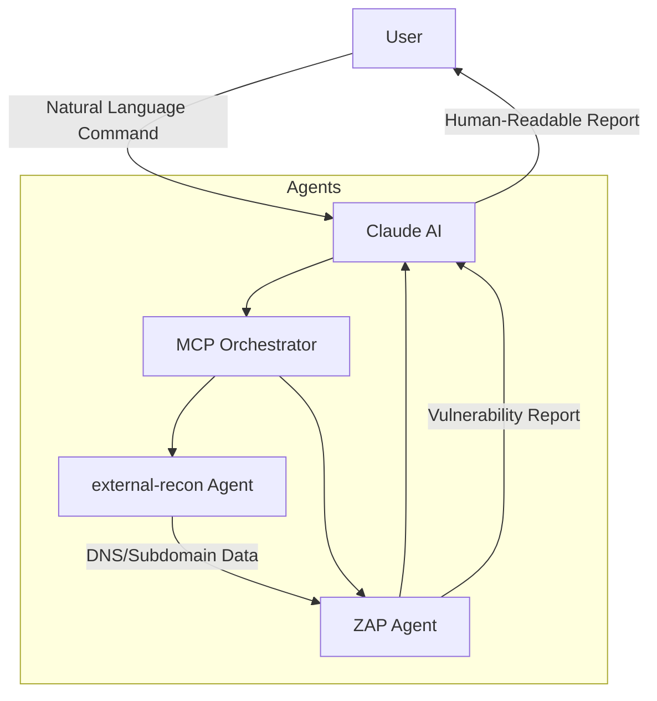

# MCP FOR CYBERSECURITY (ZAP Integration + External Recon)

## Dokumentasi dan Penggunaan

### Ringkasan
Dokumen ini menjelaskan agen MCP eksternal dan integrasinya dengan ZAP (Zed Attack Proxy) untuk pengujian keamanan web otomatis. Sistem ini menggabungkan kemampuan analisis Claude dengan alat keamanan melalui protokol MCP.

### Diagram Arsitektur

### Dokumentasi Penggunaan
#### Fitur Utama
* DNS Reconnaissance
* Subdomain Enumeration 
* Email security checks
* HTTP Header Analysis

### Example Of Usage
1. Pada percobaan tools ini saya menargetkan target kecamatanciseeng.bogorkab.go.id
2. Prompt yang saya gunakan menggunakan bahasa inggris sebagai berikut: "Perform  reconnaissance test on kecamatanciseeng.bogorkab.go.id"

3. Maka llm akan terhubung ke MCP untuk melakukan reconnaissance menggunakan tools yang sudah disediakan sebelumnya

Proggress tiap-tiap tools bisa dilihat

4. Kemudian setelah selesai menjalankan semua tools yang tersedia, llm akan membuat laporan analisis dari output yang ada

5. Walaupun sudah menghasilkan laporan tapi llm masih menawarkan untuk melakukan penjelasan tambahan maupun uji tambahan dengan memanfaatkan tools yang ada (contoh seperti gambar: "Would you like me to elaborate on any specific aspect of the findings or perform additional analysis on particular areas?")

6. Coba lanjutkan pengujian untuk api

7. Maka llm akan melakukan pengujian tambahan untuk API bahkan menemukan hasil baru yang berbeda sebelumnya

Kendala dalam pengujian adalah akun claude yang saya gunakan masih gratis sehingga terdapat batas dalam penggunaan llm
